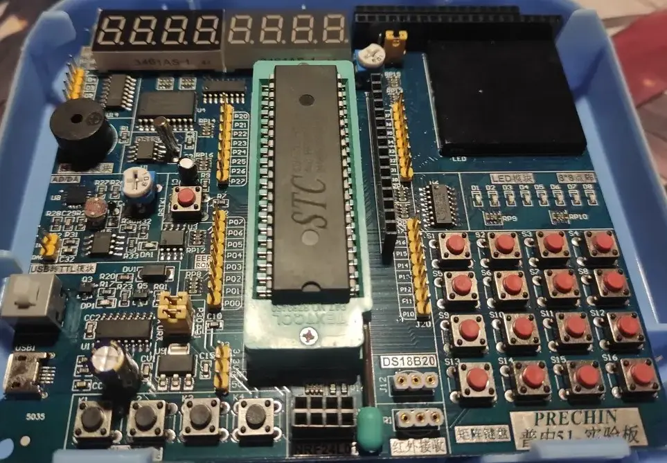

我刚接触bms时，心血来潮想自己做个手台。但我的电子科技知识匮乏，动手能力也差，只是稍微看了些设计方案就草率开始行动——最终是毫无悬念的大失败：焊坏了3个焊盘、浪费了15张PCB、吃灰了一堆元件，我忏悔😭。对此一直耿耿于怀，所以大学加个社团，看看能不能进去学点什么再去追求我未竟的夙愿；当然不止手台，我还有很多别的小玩具想做。

社团首先介绍51系的单片机，我起初做手台尝试的Arduino，虽然Arduino也算简单的，但51事实地更简单，确实应该是我首先应该看看的。

本篇记录我对社团发的考核任务的实现方案。

****

## 任务内容

题目抽签来的，抽到个比较简单的😏：
```txt
电子时钟

基础部分：
1.无论什么情况，当有按键按下蜂鸣器会响一声（10分）
2.可以通过按键设置时间（切换时分秒），并有基本的时间功能，复位默认05：00：00用 24 小时制（20分）。
3.实现秒表功能，秒暂停键按下停止计时，秒复位键按下後，秒回到00（20分）
4.通过按键实现闹钟设置功能，闹钟时间到蜂鸣器响5次，闹钟时间自己可自己设定（20分）
发挥部分：
1.通过按键可设定日期并显示 （10分）。
2.通过按键实现计时器的功能，即设定时间进行倒计时，倒计时时间可暂停默认10分钟，(也可自己设定)，倒计时结束蜂鸣器响3下或者LED闪烁3次（15分）
3.基础部分第3点当秒表停止计时时，可用存储模块储存记录时间数据，并复现（5分）
```

## 我的方案

### 材料清单



这就是全部了。我没有预先买任何材料，连这个也是从社团借来的。实现电子时钟应该要用上 *LCD1602* 模块，但是这块实验板上自带的模块已经足够实现题目要求的所有功能。既然如此，那就没有必要再买什么了😝。

### 开发环境

社团用的环境是 *keil5* + *stc-isp*。

keil5算是老东西了，没有黑暗主题和自动补全，更不必说其他功能，我要用更现代的环境那就要另寻他法：

编译器[SDCC](https://sdcc.sourceforge.net) + 开发环境[EIDE](https://github.com/github0null/eide) + 下载器[stcgal](https://github.com/grigorig/stcgal)

刚开始遇上一堆问题，工作环境配置、keil和sdcc的语法差异、链接器报错之类的，还好都平稳解决，搞特殊果然总是麻烦一点🤐。

### 总体思路

使用实验板自带的两个 *3461AS* 数码管、蜂鸣器，以及四个独立按键，实现所有功能。

就设置成5种模式：

1. 时钟 `clock()`
2. 日期 `date()` \
    算闰年的代码占了好多空间……
3. 闹钟 `alarm()`
4. 秒表 `timer()` \
    秒表最多储存10个时间数据，没有必要做太多。
5. 沙漏 `sandglass()`

总体结构是用4个按键构成多级菜单，分别控制各个模式，结构示意如下：

> “｜”後的表示长按触发的功能

```txt
K1 -> Clock Mode | Date Mode
    K1 -> toggle format
    K2 -> setting
        K1 -> toggle unit | apply
        K2 -> minus
        K3 -> plus
        K4 -> go back
    K3 -> reset
    K4 -> go back

K2 -> Alarm Mode
    K1 -> toggle unit | apply
    K2 -> minus
    K3 -> plus
    K4 -> go back

K3 -> Timer Mode
    K1 -> start/pause | load
        K1 -> clear
        K2 -> previous
        K3 -> next
        K4 -> go back
    K2 -> save
    K3 -> reset
    K4 -> go back

K4 -> Sandglass Mode
    K1 -> start/pause
    K2 -> setting
        K1 -> toggle unit | apply
        K2 -> minus
        K3 -> plus
        K4 -> go back
    K3 -> reset
    K4 -> go back
```

### 按键功能

实验板上那矩阵键盘的16个按钮也能用，但是感觉不方便管理，就用4个得了；也没有那么多功能需要用到长按，所以长按只写在K1里。

### 定时器和中断系统

用到了 `T0` `T1` 两个内部定时器。

`T0` 用于需要触发的模式：计时器和沙漏，用户通过按钮控制 `TR0` ，状态为开启时才工作；

`T1` 用于需要持续运行的模式：时钟和闹钟，日期等着时钟的溢加就得，所以没有放进去。

### process类方法

这类方法通过中断系统的执行来处理各个功能的运行逻辑，只需考虑溢加和各单位的进位就得。

### setting类方法

这类方法让用户调整时间数据，和process类一样只需注意进位，不同之处是多了下溢的情况。

unsigned char 类型的数值范围是0~255，发生下溢时会从0跳至255。

## 遭遇的问题

没有遇到难以逾越的障碍，基本是一些细枝末节卡得我发慌，然後突然莫名其妙地全部迎刃而解😩。

- 忘记打开中断系统的总开关(EA)；
- `switch` 的每个 `case` 都要加上 `break;` 否则它会继续往下执行；

## 没实现的效果

- **根菜单是空的** \
    就显示了个 `[------]` ，其实可以设定个默认模式之类的，但是懒得弄了。
- **74HC595** \
    用 *74HC245* 驱动的数码管，但是控制数码管显示位的引脚和那一排LED的是共用的，所以有三个LED总是常亮，想换 *74HC595* 驱动数码管，但是懒得学了。
- **按键位置不合适** \
    Timer读取历史记录时是K1按钮清空历史数据，应该把调整加减的按钮全设为K1和K2才对，这样清零和复位就都放在K3了，但是懒得挪了。
- **数码管闪烁** \
    本来以为 `delay()` 没办法实现的，做完才想到其实也能行的，但是懒得再搞了。
- **统一蜂鸣器频率** \
    忘记了，懒得调了。

总结与反思：懒得。

## 收尾

这算是我第一个正经做出来的项目呢，前前後後写了两周多，最终还挺像那么一回事。这个项目不会再更新了，毕竟只是个小小的作业而已，做完之後就把板子还回去了，没机会再调试。

## 参考资料

[普中官方数据手册](https://www.stcmicro.com/datasheet/STC89C51RC-cn.pdf)

[51单片机入门教程-2020版 - Bilibili](https://www.bilibili.com/video/BV1Mb411e7re)

[入坑单片机--[12] - Bilibili](https://www.bilibili.com/video/BV1YV4y1K72Q)
