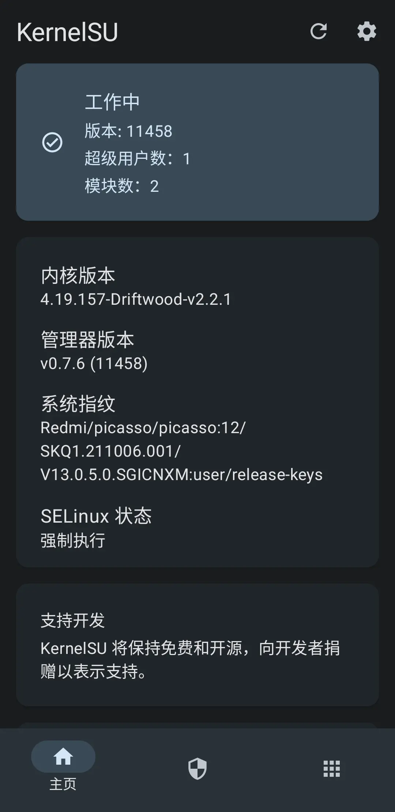

想试试新的root方案 *KernelSU* ，但我手机的内核版本是4.19，用不得通用内核镜像，需要自行编译内核，幸好KernelSU的[非官方支持列表](https://kernelsu.org/zh_CN/guide/unofficially-support-devices.html)中有大佬在维护picasso的内核源码。

本篇记录我借助 **@EndCredits** 大佬维护的[kernel_xiaomi_sm7250](https://github.com/EndCredits/kernel_xiaomi_sm7250)给我的手机编译内核。

## 搭建环境

写了个dockerfile简化环境搭建，刚接触docker的时候不知道dockerfile，每次开新容器都要手动再配一遍环境，累到癫去😢。

```sh
git clone https://github.com/Proxyerium/picasso-build-host.git
cd picasso-build-host
docker build --rm -t picasso-build-host .
```

等待docker镜像生成完毕，然後运行一个虚拟机：

```sh
docker run -it --name picasso picasso-build-host
```

## 集成KernelSU

> 如果curl连接失败的话，换个DNS试试

将KernelSU添加到内核源码的根目录：

```sh
curl -LSs "https://raw.githubusercontent.com/tiann/KernelSU/main/kernel/setup.sh" | bash -
```

defconfig中添加相关配置：

```sh
echo -e "CONFIG_KPROBES=y\nCONFIG_HAVE_KPROBES=y\nCONFIG_KPROBE_EVENTS=y" >> ./arch/arm64/configs/vendor/picasso_user_defconfig
```

## 编译内核

> 在编译之前，如果需要配置编译进内核的内容：
> ```sh
> make ARCH=arm64 LLVM=1 O=../out -j$(nproc --all) menuconfig
> ```

现在是编译时间：

```sh
sudo ./build.sh all
```

等待编译结束，脚本会自动打包好所有东西，找到 `Target File` 指示的文件，传到宿主机，把该文件刷进手机就得了：

```sh
docker cp picasso:/build-host/out/AnyKernel3-picasso/xxxxx.zip .
```

> 
> 成功，KernelSU工作中😋

## 参考资料

[如何为非 GKI 内核集成 KernelSU](https://kernelsu.org/zh_CN/guide/how-to-integrate-for-non-gki.html)

[Build a Kernel for Redmi K30 5G by your self.](https://blog.crepuscular-aosp.icu/blogs/linux/build-kernel.html)
